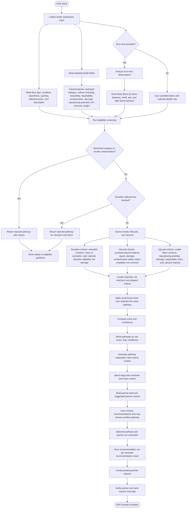

# ClothCycle PH DSS Process Flow

## DSS Outputs

- Ranked pathway recommendations for `donate`, `recycle`, and `upcycle`
- Possible `rejected` output for restricted or route-blocked submissions
- Confidence and score per pathway
- Matched, not matched, and skipped criteria
- Partner-facing brief with item, weight, bag color, burn-test context, and user notes
- Saved DSS audit records in `recommendation_runs` and `recommendation_results`
