# New Revised Developed DSS Process Flow

```mermaid
flowchart TD
  Start([DSS starts]) --> LoadSubmission[Load saved submission and detail records]
  LoadSubmission --> BasicInput[Read item type, condition, cleanliness, quantity, intended action, buyback interest, photos, and user notes]
  LoadSubmission --> DetailInput[Read detailed textile answers]
  DetailInput --> DetailFields[Fabric signals, material/fiber composition, restricted category, uniform branding, wearability, repairability, contamination, damage, repurposing potential, trim removal, and weight]
  LoadSubmission --> BurnChoice{Burn test performed?}

  BurnChoice -- Yes --> BurnAnalysis[Compare flame moment, flame behavior, after-flame behavior, smell, and ash]
  BurnAnalysis --> FiberRank[Rank likely fabric fibers and confidence]
  BurnChoice -- No --> FabricFallback[Use form fabric/material signals only]

  BasicInput --> Eligibility[Run eligibility screening]
  DetailFields --> Eligibility
  FiberRank --> Eligibility
  FabricFallback --> Eligibility

  Eligibility --> Restricted{Restricted textile or unsafe contamination?}
  Restricted -- Yes --> Rejected[Return rejected recommendation with safety reason]
  Rejected --> RejectedOutput[Show guidance and stop normal pathway scoring]

  Restricted -- No --> DonationBlock{Donation selected but blocked?}
  DonationBlock -- Yes --> DonationRejected[Return rejected recommendation for donation route]
  DonationRejected --> RejectedOutput

  DonationBlock -- No --> ScoreAll[Score Donate, Recycle, and Upcycle]
  ScoreAll --> DonateScore[Donate rules: clean or washable, wearable, low damage, safe material, no identifiable uniform branding]
  ScoreAll --> RecycleScore[Recycle rules: damaged or no longer direct-use, safe contamination level, material signal, batch suitability, removable trims]
  ScoreAll --> UpcycleScore[Upcycle rules: usable fabric sections, repair/redesign potential, manageable damage, manageable trims, repurposing value]

  DonateScore --> Criteria[Build rule-check results]
  RecycleScore --> Criteria
  UpcycleScore --> Criteria
  Criteria --> CriteriaGroups[Separate matched, not matched, and skipped criteria]
  CriteriaGroups --> PreferenceBoost[Apply small score boost if user's selected pathway matches the route]
  PreferenceBoost --> ScoreConfidence[Compute pathway score and confidence]
  ScoreConfidence --> Rank[Rank recommendations by raw score]
  Rank --> Explain[Generate readable DSS explanation]
  Explain --> BagColor[Attach shipping bag color: green donation, white recycling, black upcycling]
  BagColor --> RouteEstimate[Attach lightweight distance/carbon estimate when partner context is available]
  RouteEstimate --> PartnerContext[Load active or pending partners with service/location context]
  PartnerContext --> Review[Show recommendation cards and partner choices to user]

  Review --> UserSelect{User selects pathway and partner?}
  UserSelect -- No --> KeepReview[Remain on DSS review page]
  KeepReview --> Review
  UserSelect -- Yes --> DuplicateCheck{Same submission, partner, and pathway already sent?}
  DuplicateCheck -- Yes --> ExistingRequest[Return existing partner request]
  DuplicateCheck -- No --> SaveRun[Save recommendation run]
  SaveRun --> SaveResult[Save selected recommendation result and output payload]
  SaveResult --> CreateRequest[Create pending transaction request]
  CreateRequest --> AssignSubmission[Update submission assigned partner, service type, and buyback preference]
  AssignSubmission --> Notify[Notify user and partner]
  ExistingRequest --> Notify
  Notify --> End([DSS handoff complete])
```

## DSS Inputs Used By Current Code

- `submissions`: item type, condition, fabric, cleanliness, description, photos, service type, quantity, buyback interest, upcycle request.
- `submission_details`: item types, fabric types, custom fabric text, fabric identification, brand visibility, restricted category, uniform branding, fiber composition, wearability, repairability, contamination level, damage classification, repurposing potential, trim removal, weight value, and weight unit.
- `burn_tests`: performed flag, page, flame moment, flame behavior, after-flame behavior, smell, and ashes.
- Partner/location context: active or pending partners, accepted service types, address, latitude, longitude, and capacity notes.

## DSS Outputs Used By The App

- Ranked recommendations for `donate`, `recycle`, and `upcycle`.
- Possible `rejected` result for restricted or route-blocked submissions.
- Score, confidence, rank, explanation, matched criteria, not matched criteria, and skipped criteria.
- Partner-facing brief with item details, quantity, weight, bag color, fabric/burn-test context, user notes, and buyback preference when relevant.
- Selected recommendation audit in `recommendation_runs` and `recommendation_results`.
- Partner request record in `transactions`.
