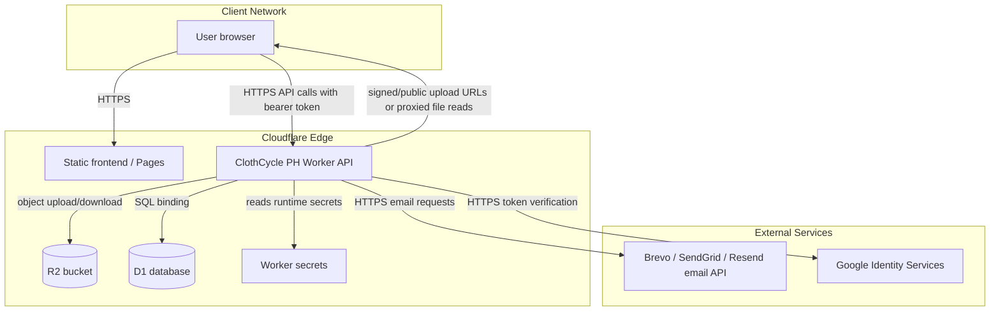
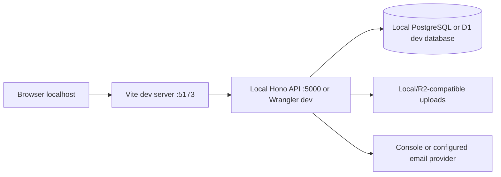

# Network Architecture

## Production Network Flow

1. Browser loads the React/Vite static frontend.
2. Frontend sends authenticated API requests to the Hono Worker API.
3. Worker verifies JWT/session state and applies role guards.
4. Worker reads/writes the D1 database for users, submissions, DSS records, requests, messages, notifications, tracking, and admin records.
5. Worker uploads or retrieves images and attachments through R2.
6. Worker sends verification, two-factor, and password-reset emails through the configured email provider.
7. Google login uses Google Identity verification from the backend.

## Local Development Network Flow

## Network Security Notes

- The browser does not connect directly to the database.
- The browser does not receive backend secrets.
- Worker secrets should hold `JWT_SECRET`, `TWO_FACTOR_ENCRYPTION_KEY`, and the chosen email API key.
- R2 bucket access is mediated by the backend upload/download routes or public base URL configuration.
- CORS is controlled by configured origins and localhost dev allowances.
