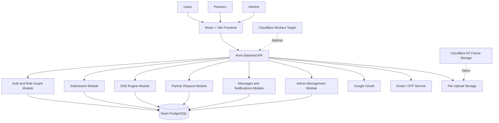
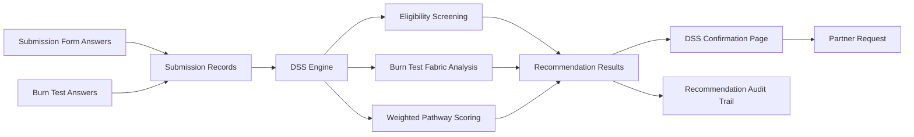
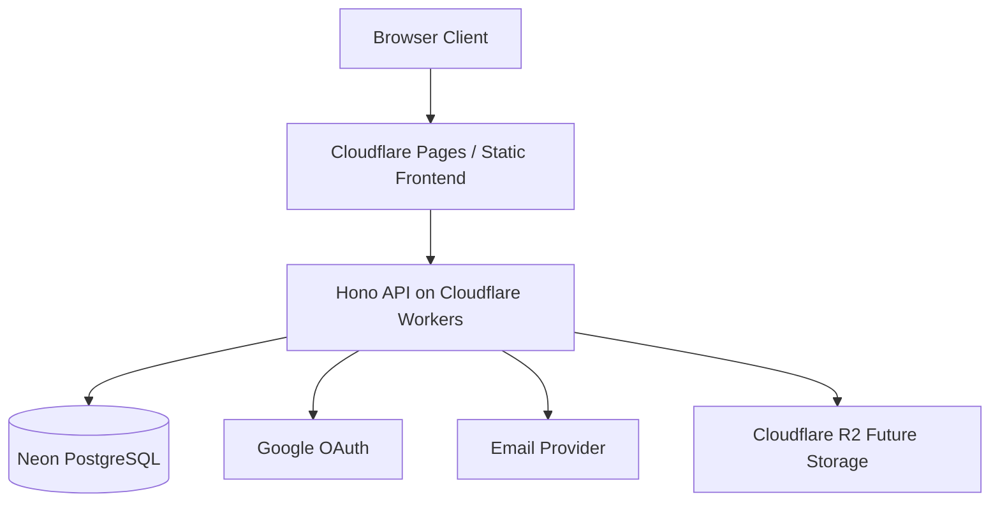

# ClothCycle PH System Architecture

## Architecture Overview

ClothCycle PH uses a layered web application architecture. The frontend handles role-based user interaction, the backend exposes Hono API routes and business logic, the DSS engine evaluates textile submissions, and Neon PostgreSQL stores transactional, DSS, audit, messaging, and notification data.

## Main Components

| Layer | Component | Responsibility |
|---|---|---|
| Presentation Layer | React + Vite frontend | Login, registration, dashboards, textile submission, DSS confirmation, messages, notifications, settings |
| API Layer | Hono backend | Handles REST API requests, authentication checks, role checks, validation, and service orchestration |
| Decision Support Layer | DSS Engine | Evaluates textile details and burn-test answers, ranks Recycle / Donate / Upcycle, records audit trail |
| Data Layer | Neon PostgreSQL | Stores users, partners, submissions, DSS runs/results, transactions, messages, notifications, admin logs |
| External Services | Google OAuth, Email/OTP, file storage | Account sign-in, verification, reset flows, uploaded images and attachments |
| Deployment Target | Cloudflare Workers | Planned runtime target for the Hono backend |

## User Flow

1. User registers or logs in.
2. User submits textile details, optional burn-test answers, images, and intended pathway.
3. Backend saves the submission to Neon PostgreSQL.
4. DSS Engine evaluates the saved answers.
5. DSS confirmation page shows ranked Recycle / Donate / Upcycle recommendations.
6. User selects the final pathway and sends the request to a partner.
7. Partner views the request, DSS explanation, images, and user brief.
8. Partner accepts, declines, or completes the request.
9. User receives notification and can track status from request pages.

## Partner Flow

1. Partner logs in through partner account.
2. Partner views assigned textile requests.
3. Partner reviews item details, DSS reasoning, user brief, and uploaded images.
4. Partner updates the request status.
5. System notifies the user.
6. Partner may submit rule/preference change requests to admin.

## Admin Flow

1. Admin logs in through admin dashboard.
2. Admin manages users, partners, submissions, DSS records, and system activity.
3. Admin reviews partner rule change requests.
4. Admin accepts, declines, or asks for more information.
5. System records audit activity and notifies the partner.

## DSS Architecture

The DSS engine currently scores Recycle, Donate, and Upcycle. Buyback is not a scored DSS pathway. It is a yes/no preference shown only when the final selected pathway is Upcycle.

## Database Groups

| Group | Tables |
|---|---|
| Identity and Auth | `users`, `user_preferences`, `password_reset_tokens`, `user_recovery_codes`, `auth_events`, `rate_limits` |
| Partner Management | `partners`, `partner_rule_change_requests` |
| Textile Submission | `submissions`, `submission_details`, `burn_tests`, `submission_images` |
| DSS Audit | `recommendation_runs`, `recommendation_results`, `recommendation_feedback`, `dss_rules` |
| Transactions | `transactions` |
| Communication | `conversations`, `messages`, `message_attachments`, `notifications` |
| Administration | `activity_logs`, `schema_migrations` |

## Deployment View

For local QA, the frontend runs with Vite and points to the local Hono backend through `VITE_API_URL`. For deployment, the same Hono API is intended to run on Cloudflare Workers while continuing to use Neon PostgreSQL as the production database.
