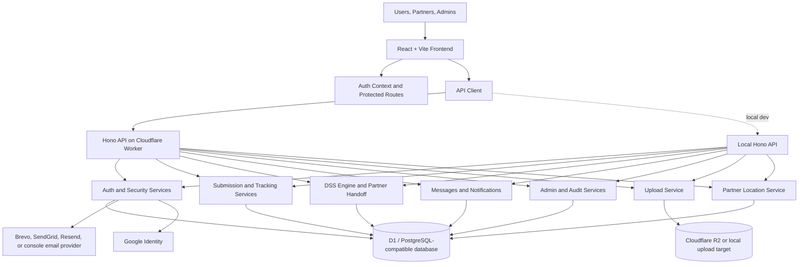
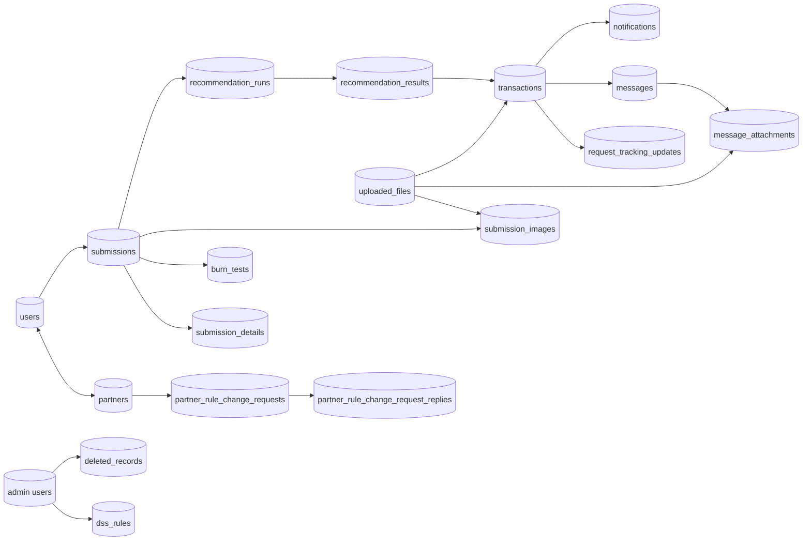
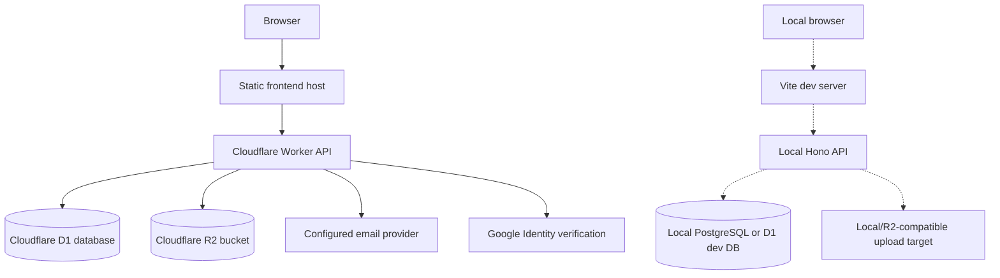

# New Revised System Architecture

## Architecture Overview

ClothCycle PH is a role-based web application with a React frontend, Hono API layer, rule-based DSS engine, Cloudflare Worker deployment target, and a D1-compatible database schema. The project also retains PostgreSQL migrations for local or alternate deployment paths.

## Main Layers

| Layer | Current components | Responsibility |
|---|---|---|
| Presentation | React, Vite, React Router, AuthContext, role-protected routes | Landing, login/signup, dashboards, submission wizard, DSS review, my requests, messages, notifications, settings, admin pages |
| API | `backend/src/worker.ts`, `backend/src/honoLocalApp.ts` | REST API, CORS, secure headers, request validation, authentication, role checks |
| Auth | `authD1Service`, JWT utilities, email/TOTP 2FA, password reset, Google login | Signup, login, session restore, verification, forgot/reset password, security events |
| Submission | `d1SubmissionService` | Textile submissions, detailed textile answers, burn tests, images, delivery tracking updates |
| DSS | `dssEngine`, `d1DssService`, `d1GisService` | Eligibility screening, pathway scoring, recommendation audit, partner suggestions, route/bag context, partner handoff |
| Partner Requests | `transactions` through DSS and transaction services | Pending, accepted, rejected, completed partner request lifecycle |
| Communication | `d1MessageService`, `d1NotificationService` | Automatic request messages, tracking messages, outcome messages, notification counts/preferences |
| Admin | Admin routes/services and dashboard pages | User/partner management, required partner location, submission status, DSS rules, rule-change requests, deleted records |
| Storage | R2 upload service and `uploaded_files` registry | Submission images, message attachments, partner outcome photos |

## Current Frontend Route Map

- Public: `/`, `/login`, `/signup`, `/terms`, `/privacy`
- User: `/dashboard`, `/submit`, `/dss/:submissionId`, `/dss-requests`, `/my-requests`
- Partner: `/partner`
- Admin: `/admin`, `/admin/deleted-records`
- Shared protected: `/settings`, `/notifications`, `/messages`

## Current Data Architecture

## DSS Architecture

The DSS is an explainable rule-based module. It reads saved submission data, screens restricted categories and unsafe contamination, optionally analyzes burn-test observations, scores Donate/Recycle/Upcycle, generates matched/not-matched/skipped criteria, and saves the selected recommendation when the user sends it to a partner.

Buyback is not scored as a standalone DSS route in the current engine. It is stored as an upcycle-related user preference when applicable.

## Runtime And Deployment View

## Security And Access Control

- API routes use bearer JWT authentication for protected requests.
- Role guards restrict user, partner, and admin dashboards and endpoints.
- Partner request updates require the assigned partner, partner email match, or admin.
- Tracking updates can only be created by the request owner after the partner request is accepted.
- Partner locations are required for partner accounts because they are displayed during DSS partner selection.
- Secrets such as `JWT_SECRET`, `TWO_FACTOR_ENCRYPTION_KEY`, and email API keys are server-side only.
