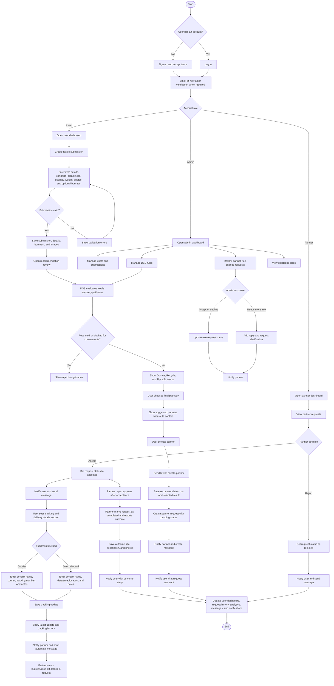

# ClothCycle PH System Process Flow

## Status Values Reflected In The Flow

- Submission status: `pending`, `verified`, `processed`, `rejected`
- Partner request status: `pending`, `accepted`, `completed`, `rejected`
- Tracking progress: `request_sent`, `scheduled`, `in_transit`, `dropoff_completed`, `completed`
- Rule-change request status: `pending`, `accepted`, `declined`, `needs_more_information`, with schema support also showing `approved` and `implemented`
