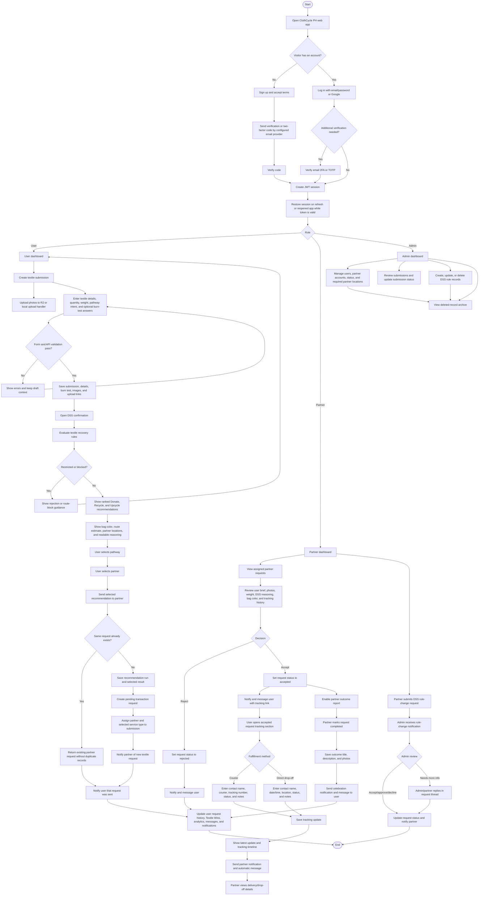

# New Revised Developed System Process Flow

## Current Status Values Reflected

- User role: `user`, `partner`, `admin`
- User status: `active`, `inactive`, `suspended`
- Partner status: `pending`, `active`, `inactive`, `rejected`
- Submission status: `pending`, `verified`, `processed`, `rejected`
- Partner request status: `pending`, `accepted`, `completed`, `rejected`
- Tracking progress: `request_sent`, `scheduled`, `in_transit`, `dropoff_completed`, `completed`
- Tracking fulfillment method: `drop_off`, `shipping`, `pickup`, `other`
- Rule-change status: `pending`, `accepted`, `approved`, `declined`, `needs_more_information`, `implemented`

## Current Storage Points

- Submissions are stored in `submissions`, `submission_details`, `burn_tests`, and `submission_images`.
- DSS audit is stored in `recommendation_runs` and `recommendation_results`.
- Partner requests are stored in `transactions`.
- User delivery updates are stored in `request_tracking_updates`.
- Partner outcome stories are stored on `transactions`.
- Notifications and automatic conversation messages are stored in `notifications` and `messages`.
