# New Revised Use Case Diagram

```mermaid
flowchart LR
  Visitor([Visitor])
  User([Registered User])
  Partner([Partner])
  Admin([Admin])
  Email[[Email Provider]]
  Google[[Google Identity]]
  Storage[[File Storage]]

  subgraph Public["Public Access"]
    UC1((View landing page))
    UC2((Read terms and privacy))
    UC3((Sign up))
    UC4((Log in))
    UC5((Forgot password))
  end

  subgraph UserCases["User Use Cases"]
    U1((Manage profile and settings))
    U2((Submit textile details))
    U3((Upload submission photos))
    U4((Review DSS recommendations))
    U5((Select pathway and partner))
    U6((Send partner request))
    U7((View request status))
    U8((Add tracking or drop-off details))
    U9((View tracking timeline))
    U10((Receive outcome story and photos))
    U11((Read notifications))
    U12((Message partners))
  end

  subgraph PartnerCases["Partner Use Cases"]
    P1((View assigned requests))
    P2((Review DSS brief and photos))
    P3((Accept or reject request))
    P4((View delivery details))
    P5((Mark request completed))
    P6((Report textile outcome))
    P7((Reply to user messages))
    P8((Submit DSS rule-change request))
    P9((Read partner notifications))
  end

  subgraph AdminCases["Admin Use Cases"]
    A1((Manage users))
    A2((Create or edit partner accounts))
    A3((Require partner location))
    A4((Manage submissions))
    A5((Manage DSS rules))
    A6((Review rule-change requests))
    A7((View deleted records))
    A8((Review DSS audit/export))
    A9((Read admin notifications))
  end

  Visitor --> UC1
  Visitor --> UC2
  Visitor --> UC3
  Visitor --> UC4
  Visitor --> UC5

  UC3 --> Email
  UC4 --> Email
  UC4 --> Google
  UC5 --> Email

  User --> U1
  User --> U2
  User --> U3
  User --> U4
  User --> U5
  User --> U6
  User --> U7
  User --> U8
  User --> U9
  User --> U10
  User --> U11
  User --> U12
  U3 --> Storage

  Partner --> P1
  Partner --> P2
  Partner --> P3
  Partner --> P4
  Partner --> P5
  Partner --> P6
  Partner --> P7
  Partner --> P8
  Partner --> P9
  P6 --> Storage

  Admin --> A1
  Admin --> A2
  Admin --> A3
  Admin --> A4
  Admin --> A5
  Admin --> A6
  Admin --> A7
  Admin --> A8
  Admin --> A9

  U6 -.creates.-> P1
  P3 -.notifies.-> U7
  U8 -.notifies.-> P4
  P6 -.notifies.-> U10
  P8 -.routes to.-> A6
  A6 -.responds to.-> P8
```

## Actor Summary

- Visitor can browse public pages and start authentication flows.
- User can submit textile items, review DSS recommendations, send partner requests, update accepted-request delivery details, and receive outcome stories.
- Partner can review assigned requests, accept/reject, view delivery details, complete requests, report outcomes, message users, and request DSS rule changes.
- Admin can manage accounts, partners, locations, submissions, DSS rules, rule-change requests, audit exports, and deleted records.
